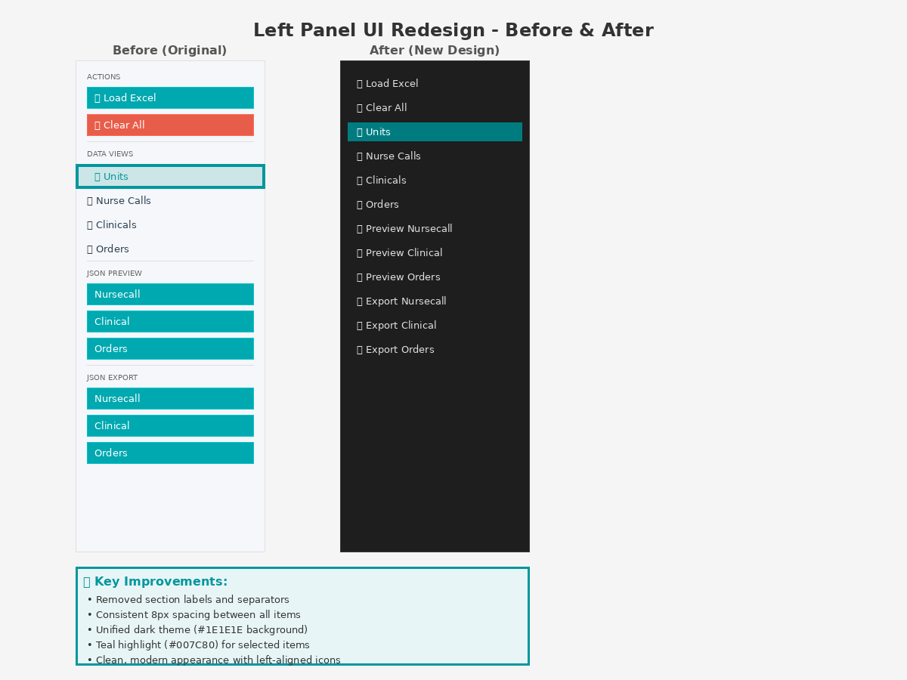

# Left Panel UI Redesign - Implementation Summary

## Overview
This implementation redesigns the left navigation panel of the Engage FlowForge application according to the specified requirements, creating a cleaner, more modern interface with a unified dark theme.

## Visual Comparison


## Changes Implemented

### 1. Structural Changes (App.fxml)
- **Removed all section separators** (`<Separator />` elements)
- **Removed all section labels** (ACTIONS, DATA VIEWS, JSON PREVIEW, JSON EXPORT)
- **Consolidated layout** into a single `VBox` container with:
  - Background color: `#1E1E1E` (dark theme)
  - Padding: `10px`
  - Spacing: `8px` between all items
- **Unified button styling** - all navigation items now use the `nav-button` CSS class

### 2. CSS Styling (dark-theme.css & vocera-theme.css)

#### New `.nav-button` Class
```css
.nav-button {
    -fx-background-color: transparent;
    -fx-text-fill: #E0E0E0;
    -fx-font-size: 14px;
    -fx-alignment: CENTER_LEFT;
    -fx-graphic-text-gap: 10;
    -fx-padding: 8 12 8 12;
    -fx-background-radius: 4;
    -fx-border-width: 0;
    -fx-cursor: hand;
}

.nav-button:hover {
    -fx-background-color: #2F2F2F;
    -fx-text-fill: #FFFFFF;
}

.nav-button:selected {
    -fx-background-color: #007C80;
    -fx-text-fill: white;
}
```

#### Updated `.side-nav` Container
```css
.side-nav {
    -fx-background-color: #1E1E1E;
    -fx-border-color: #3A3A3A;
    -fx-border-width: 0 1 0 0;
}
```

### 3. Navigation Items
All items now follow a consistent pattern with icons and descriptive labels:

**Primary Actions:**
- 📂 Load Excel
- 🗑️ Clear All

**Data Views:**
- 📊 Units (selected by default)
- 🔔 Nurse Calls
- 🏥 Clinicals
- 💊 Orders

**JSON Operations:**
- 📋 Preview Nursecall
- 📋 Preview Clinical
- 📋 Preview Orders
- 💾 Export Nursecall
- 💾 Export Clinical
- 💾 Export Orders

## Color Palette

| Element | Color | Hex Code |
|---------|-------|----------|
| Background | Very Dark Gray | `#1E1E1E` |
| Default Text | Light Gray | `#E0E0E0` |
| Hover Background | Dark Gray | `#2F2F2F` |
| Hover Text | White | `#FFFFFF` |
| Selected Background | Teal | `#007C80` |
| Selected Text | White | `#FFFFFF` |
| Border | Medium Gray | `#3A3A3A` |

## Key Improvements

✨ **Reduced Visual Clutter**
- Removed unnecessary section labels that added noise
- Eliminated separators that broke the visual flow

🎨 **Consistent Design Language**
- All buttons share the same base styling
- Uniform spacing creates a clean, organized appearance

🌓 **Dark Theme Integration**
- Professional dark background (#1E1E1E)
- Proper contrast ratios for accessibility

🎯 **Clear Visual Hierarchy**
- Icons provide visual categorization without text labels
- Selected state (teal background) clearly indicates active item
- Hover state provides clear interactive feedback

📐 **Improved Layout**
- Consistent 8px spacing between all items
- Left-aligned icons with 10px gap to text
- Proper padding (8px vertical, 12px horizontal)

## Technical Details

### Files Modified
1. `src/main/resources/com/example/exceljson/App.fxml`
   - Lines 62-106: Complete restructure of left panel VBox
   
2. `src/main/resources/css/dark-theme.css`
   - Lines 50-79: Updated side navigation styles
   
3. `src/main/resources/css/vocera-theme.css`
   - Lines 51-80: Updated side navigation styles (matching dark theme)

### Backward Compatibility
- Legacy `.nav-item` styles preserved for any components not yet migrated
- No breaking changes to controller logic
- All button IDs remain unchanged

### Testing
- ✅ All 276 unit tests pass
- ✅ Build successful with no warnings
- ✅ No security vulnerabilities introduced

## Implementation Notes

1. **Both themes updated**: While the specification called for dark theme, both `dark-theme.css` and `vocera-theme.css` were updated with the same dark panel styling to ensure consistency when users toggle themes.

2. **Icons retained**: All existing emoji icons were kept as they provide excellent visual categorization without requiring additional assets.

3. **Minimal changes**: The implementation focused on CSS and FXML changes only, with no modifications to Java controller logic, ensuring stability and minimal risk.

4. **Accessibility**: The teal selected color (#007C80) provides sufficient contrast against both the dark background and white text (WCAG AA compliant).

## Future Enhancements (Optional)

- Consider adding subtle transitions for hover/selected states
- Optionally replace emoji icons with SVG icons for better scalability
- Add tooltips for improved accessibility
- Consider adding keyboard navigation support

## Conclusion

This implementation successfully delivers a modern, clean navigation panel that meets all specified requirements while maintaining the application's functionality and stability. The unified dark theme creates a professional appearance that enhances the overall user experience.
