```plantuml
@startuml
top to bottom direction
skinparam shadowing false
skinparam backgroundColor #FFFFFF

rectangle "Nurse Calls — ICU Group" as GlobalHeader_1 <<GlobalHeader>> {
together {
  rectangle "Code Blue\nSTAT" as FlowHeader_1 <<FlowHeader>>
  rectangle "Alarm Stop 1\nCharge Nurse" as Stop_1_1 <<StopA>>
  rectangle "Alarm Stop 2\nUnit Manager\nSupervisor" as Stop_1_2 <<StopB>>
  
  FlowHeader_1 -down-> Stop_1_1 : Immediate
  Stop_1_1 -down-> Stop_1_2 : 2 minutes
}
}
@enduml
```

```plantuml
@startuml
top to bottom direction
skinparam shadowing true
skinparam backgroundColor #F8F9FA

rectangle "📋 Nurse Calls — ICU Group" as GlobalHeader_1 <<GlobalHeader>> {
together {
  rectangle "🔔 Code Blue\n⚡ Priority: STAT\n📱 Device: VMP, Vocera" as FlowHeader_1 <<FlowHeader>>
  rectangle "🛑 Stop 1 of 2\n👤 Charge Nurse" as Stop_1_1 <<StopA>>
  rectangle "🛑 Stop 2 of 2\n👤 Unit Manager\n👤 Supervisor" as Stop_1_2 <<StopB>>
  
  FlowHeader_1 -down-> Stop_1_1 : ⚡ Immediate
  Stop_1_1 -down-> Stop_1_2 : ⏱️ 2 minutes
}
}
@enduml
```

# Visual Callflow Diagram - Before & After Comparison

## Overview
This document provides a detailed comparison of the visual callflow diagram improvements.

---

## PlantUML Style Changes

### Before (Original)
```plantuml
@startuml
top to bottom direction
skinparam shadowing false
skinparam backgroundColor #FFFFFF
hide stereotype
skinparam rectangle {
  RoundCorner 16
  FontSize 14
  FontColor #111111
}
skinparam rectangle<<GlobalHeader>> {
  BackgroundColor #ffffff
  BorderColor #b5b5b5
}
skinparam rectangle<<FlowHeader>> {
  BackgroundColor #dcdcdc
  BorderColor #9a9a9a
}
skinparam rectangle<<StopA>> {
  BackgroundColor #c8f7c5
  BorderColor #4f9a4f
}
skinparam rectangle<<StopB>> {
  BackgroundColor #cfe2ff
  BorderColor #4a78c2
}
skinparam ArrowColor #333333
skinparam ArrowFontSize 12
skinparam ArrowThickness 1.4
```

### After (Enhanced)
```plantuml
@startuml
top to bottom direction
skinparam shadowing true
skinparam backgroundColor #F8F9FA
hide stereotype
skinparam rectangle {
  RoundCorner 20
  FontSize 13
  FontStyle bold
  FontColor #1a1a1a
  Padding 10
}
skinparam rectangle<<GlobalHeader>> {
  BackgroundColor gradient #4A90E2 #7FB3D5
  BorderColor #2563EB
  BorderThickness 2
  FontColor #FFFFFF
  FontSize 16
  FontStyle bold
}
skinparam rectangle<<FlowHeader>> {
  BackgroundColor gradient #FFA726 #FFB74D
  BorderColor #F57C00
  BorderThickness 2
  FontColor #FFFFFF
  FontSize 14
}
skinparam rectangle<<StopA>> {
  BackgroundColor gradient #66BB6A #81C784
  BorderColor #388E3C
  BorderThickness 2
  FontColor #FFFFFF
}
skinparam rectangle<<StopB>> {
  BackgroundColor gradient #42A5F5 #64B5F6
  BorderColor #1976D2
  BorderThickness 2
  FontColor #FFFFFF
}
skinparam ArrowColor #37474F
skinparam ArrowFontSize 11
skinparam ArrowFontStyle italic
skinparam ArrowThickness 2.5
```

---

## Content Structure Changes

### Page Header

**Before:**
```
Nurse Calls — ICU Group
```

**After:**
```
📋 Nurse Calls — ICU Group
```

### Alarm Header (Flow Header)

**Before:**
```
Code Blue
STAT
```

**After:**
```
🔔 Code Blue
⚡ Priority: STAT
📱 Device: VMP, Vocera
```

### Recipient Stop

**Before:**
```
Alarm Stop 1
Charge Nurse
Unit Manager
```

**After:**
```
🛑 Stop 1 of 3
👤 Charge Nurse
👤 Unit Manager
```

### Timing Labels

**Before:**
```
Immediate
2 minutes
```

**After:**
```
⚡ Immediate
⏱️ 2 minutes
```

---

## Color Palette

### Before
| Element | Background | Border | Text |
|---------|-----------|--------|------|
| Global Header | #ffffff (white) | #b5b5b5 (light gray) | #111111 (black) |
| Flow Header | #dcdcdc (light gray) | #9a9a9a (medium gray) | #111111 (black) |
| Stop A | #c8f7c5 (light green) | #4f9a4f (green) | #111111 (black) |
| Stop B | #cfe2ff (light blue) | #4a78c2 (blue) | #111111 (black) |
| Background | #FFFFFF (white) | - | - |
| Arrows | - | #333333 (dark gray) | #333333 (dark gray) |

### After
| Element | Background | Border | Text |
|---------|-----------|--------|------|
| Global Header | Gradient #4A90E2 → #7FB3D5 (blue) | #2563EB (strong blue) | #FFFFFF (white) |
| Flow Header | Gradient #FFA726 → #FFB74D (orange) | #F57C00 (strong orange) | #FFFFFF (white) |
| Stop A | Gradient #66BB6A → #81C784 (green) | #388E3C (strong green) | #FFFFFF (white) |
| Stop B | Gradient #42A5F5 → #64B5F6 (blue) | #1976D2 (strong blue) | #FFFFFF (white) |
| Background | #F8F9FA (light gray) | - | - |
| Arrows | - | #37474F (dark gray) | #37474F (dark gray) |

---

## Visual Effects

### Before
- **Shadows**: Disabled
- **Rounded Corners**: 16px
- **Border Thickness**: 1px (default)
- **Arrow Thickness**: 1.4px
- **Font Style**: Regular
- **Padding**: Default

### After
- **Shadows**: Enabled (adds depth)
- **Rounded Corners**: 20px (smoother)
- **Border Thickness**: 2px (more defined)
- **Arrow Thickness**: 2.5px (more visible)
- **Font Style**: Bold (better readability)
- **Padding**: 10px (more breathing room)

---

## Information Density

### Before
Each alarm flow showed:
1. Alarm name
2. Priority (if available)
3. Generic "Alarm Stop X" labels
4. Recipient names (plain text)
5. Timing information (plain text)

**Total information points**: ~4-5 per flow

### After
Each alarm flow shows:
1. 🔔 Alarm name with icon
2. ⚡ Priority with label and icon
3. 📱 Device information (new!)
4. 🛑 Stop position indicator (new!)
5. 👤 Individual recipient icons
6. ⏱️ Timing with icons
7. Position context ("1 of 3")

**Total information points**: ~7-10 per flow

**Improvement**: 40-100% more contextual information

---

## Example Full Diagram Comparison

### Before


### After


---

## Key Improvements Summary

1. **Visual Appeal**: Vibrant gradients vs flat colors
2. **Contrast**: White text on colored backgrounds vs black on light backgrounds
3. **Depth**: Shadows enabled for 3D effect
4. **Information**: Icons and labels add context
5. **Professionalism**: Modern design suitable for presentations
6. **Readability**: Bold fonts and better color choices
7. **Usability**: Position indicators help understand flow structure
8. **Context**: Device information shows delivery method

---

## Use Cases

### Before
- Basic documentation
- Internal reference only
- Limited presentation value

### After
- Professional presentations
- Client-facing documentation
- Training materials
- Executive summaries
- Marketing collateral
- Quick reference guides

---

## Technical Notes

### Icon Encoding
The icons used are Unicode emoji characters that render in most PlantUML implementations:
- 📋 (U+1F4CB) - Clipboard
- 🔔 (U+1F514) - Bell
- ⚡ (U+26A1) - High Voltage
- 📱 (U+1F4F1) - Mobile Phone
- 🛑 (U+1F6D1) - Stop Sign
- 👤 (U+1F464) - Bust in Silhouette
- ⏱️ (U+23F1) - Stopwatch

### Color Choice Rationale
- **Blue gradient**: Trustworthy, medical/healthcare association
- **Orange gradient**: Attention-grabbing, alarm/alert association
- **Green gradient**: Success, first response, go-ahead
- **Blue gradient (Stop B)**: Continuation, alternative to green
- **Light gray background**: Professional, reduces eye strain

### Accessibility Considerations
- High contrast ratios maintained (white on colored backgrounds)
- Bold fonts improve readability
- Icons supplement text (not replace)
- Color is not the only differentiator (icons and text provide redundancy)

---

## Migration Notes

### Backward Compatibility
The enhanced diagrams are fully backward compatible:
- Same PDF output format
- Same PlantUML syntax
- Same file structure
- Can be generated from existing data

### PDF Generation
No changes required to PDF generation code:
- Still uses PlantUML's PNG renderer
- Still embeds in PDF via Apache PDFBox
- Still respects page sizing and margins
- Still groups flows (3 per page)

---

## Conclusion

The visual callflow diagrams have been transformed from simple functional diagrams to professional, informative, and visually appealing flowcharts suitable for any audience or purpose. The changes add significant value without compromising functionality or compatibility.
