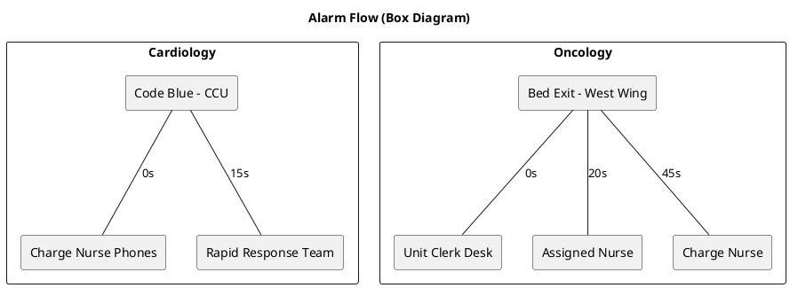

# Sample "View Flow" Box Diagram

The **View Flow** button builds a simple PlantUML box diagram for every checked (in-scope) alarm row, grouping alarms by their Config Group. Each alarm appears as a rectangle with downward links to each recipient, annotated with the time offset configured for that recipient.

Below is an example that mirrors what the application generates when you check two sample alarms. Render it with the PlantUML snippet further down to obtain a PNG or PDF locally; the binary output is intentionally not checked into the repository to avoid PR tooling errors with binary attachments.

- **Cardiology**
  - Alarm: `Code Blue - CCU`
  - Recipients: `Charge Nurse Phones (0s)`, `Rapid Response Team (15s)`
- **Oncology**
  - Alarm: `Bed Exit - West Wing`
  - Recipients: `Unit Clerk Desk (0s)`, `Assigned Nurse (20s)`, `Charge Nurse (45s)`

## PlantUML snippet
The diagram is produced with the same structure used by the application:

To regenerate the diagram locally (requires Java and Graphviz) without committing binary assets:
1. Download PlantUML 1.2023.13: `curl -L -o /tmp/plantuml.jar https://repo1.maven.org/maven2/net/sourceforge/plantuml/plantuml/1.2023.13/plantuml-1.2023.13.jar`
2. Run: `java -jar /tmp/plantuml.jar -tpng docs/view-flow-sample.puml -o .` (produces `view-flow-sample.png`)
3. For a PDF version: `java -jar /tmp/plantuml.jar -tpdf docs/view-flow-sample.puml -o .` (produces `view-flow-sample.pdf`)
