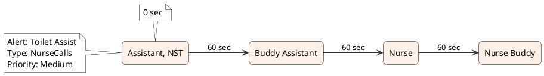

# Sample "View Flow" Box Diagram

The **View Flow** button now produces a horizontal, timeline-style box diagram for each checked (in-scope) alarm. A header note shows the alert name, flow type, and priority, while the recipients are drawn as rounded rectangles connected left-to-right with their configured time offsets labeled on the links (and the initial offset above the first box).

Below is a single-flow example that matches the in-app export layout for the attached mockup:

- Alert: `Toilet Assist`
- Type: `NurseCalls`
- Priority: `Medium`
- Recipients: `Assistant, NST (0 sec)`, `Buddy Assistant (60 sec)`, `Nurse (60 sec)`, `Nurse Buddy (60 sec)`

## PlantUML snippet
The diagram is produced with the same structure used by the application:

To regenerate the diagram locally (requires Java and Graphviz) without committing binary assets:
1. Download PlantUML 1.2023.13: `curl -L -o /tmp/plantuml.jar https://repo1.maven.org/maven2/net/sourceforge/plantuml/plantuml/1.2023.13/plantuml-1.2023.13.jar`
2. Run: `java -jar /tmp/plantuml.jar -tpng docs/view-flow-sample.puml -o .` (produces `view-flow-sample.png`)
3. For a PDF version: `java -jar /tmp/plantuml.jar -tpdf docs/view-flow-sample.puml -o .` (produces `view-flow-sample.pdf`)
