# Sample "Visual Flow" Diagram

The **Visual Flow** button now outputs a vertically stacked timeline that mirrors the "Alarm Stop" mockup: a single white header for the tab/config group, gray alert headers per row, and alternating green/blue alarm stop boxes connected by black arrows labeled with the configured delays. Exports automatically split across pages when more than three alerts are selected and scale each diagram to fill a letter-sized PDF page with small margins.

## Example Layout
- Tab / Dataset: `NurseCall`
- Configuration Group: `Acute Care NC`
- Alarm 1: `Bath Call` (priority `Medium(Edge)`)
- Alarm 2: `Bathroom Request Call` (priority `Medium(Edge)`)
- First recipient is treated as immediate; later delays show on the arrows only.

## PlantUML snippet
The snippet below matches the in-app export (white top header, gray alert headers, green/blue alarm stops, and arrow labels for timing):

```plantuml
@startuml
top to bottom direction
skinparam shadowing false
skinparam backgroundColor #FFFFFF
skinparam rectangle {
  RoundCorner 16
  FontSize 14
  FontColor #111111
}
skinparam rectangle<<GlobalHeader>> {
  BackgroundColor #ffffff
  BorderColor #b5b5b5
}
skinparam rectangle<<FlowHeader>> {
  BackgroundColor #dcdcdc
  BorderColor #9a9a9a
}
skinparam rectangle<<StopA>> {
  BackgroundColor #c8f7c5
  BorderColor #4f9a4f
}
skinparam rectangle<<StopB>> {
  BackgroundColor #cfe2ff
  BorderColor #4a78c2
}
skinparam ArrowColor #333333
skinparam ArrowFontSize 12
skinparam ArrowThickness 1.4

rectangle "NurseCall — Acute Care NC" as GlobalHeader_1 <<GlobalHeader>>

together {
  rectangle "Bath Call\nMedium(Edge)" as FlowHeader_1 <<FlowHeader>>
  rectangle "Alarm Stop 1\nRecipient:\nVAssign:(Room) CNA" as Stop_1_1 <<StopA>>
  FlowHeader_1 -down-> Stop_1_1 : Immediate
  rectangle "Alarm Stop 2\nRecipient:\nVAssign: Nurse" as Stop_1_2 <<StopB>>
  Stop_1_1 -down-> Stop_1_2 : 60 sec

  rectangle "Bathroom Request Call\nMedium(Edge)" as FlowHeader_2 <<FlowHeader>>
  rectangle "Alarm Stop 1\nRecipient:\nVAssign: CNA" as Stop_2_1 <<StopA>>
  FlowHeader_2 -down-> Stop_2_1 : Immediate
  rectangle "Alarm Stop 2\nRecipient:\nVAssign: Nurse" as Stop_2_2 <<StopB>>
  Stop_2_1 -down-> Stop_2_2 : 60 sec
}
@enduml
```

To preview locally (without committing binaries):
1. Download PlantUML 1.2023.13: `curl -L -o /tmp/plantuml.jar https://repo1.maven.org/maven2/net/sourceforge/plantuml/plantuml/1.2023.13/plantuml-1.2023.13.jar`
2. Render PNG: `java -jar /tmp/plantuml.jar -tpng docs/view-flow-sample.puml -o .`
3. Render PDF: `java -jar /tmp/plantuml.jar -tpdf docs/view-flow-sample.puml -o .`
